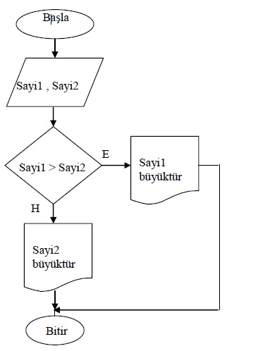

# GENEL TEKRAR

### DUCK DUCK GO
DuckDuckGo kişisel gizliliğe önem veren bir arama motorudur. Kullanıcıların IP adreslerini kaydetmemektedir.

### ALGORİTMA:
Bir sorunu çözmek veya belirlenmiş bir amaca ulaşmak için tasarlanan yola, takip edilen işlem basamaklarına algoritma denir. Algoritmalar açıkça belirtilmiş bir başlangıcı ve  sonu olan işlemler kümesidir.



### PHP NEDİR:
PHP kısaca web tabanlı bir programlama dilidir. Eskiden açılımı “Personal Home Page” yani Kişisel Anasayfa iken günümüzde gelişmesi ve daha iyi anlam kazanması ile “PHP: Hypertext Preprocessor” yani Üstün Yazı Önişlemcisi olmuş.

 Diğer web tabanlı dillere göre onlarca avantajı olan ve günümüzde en popüler dillerden birisi. İnternet üzerindeki durağan sabit yazılara dinamiklik katmamızı sağlayan bir web tabanlı dil olan PHP, en iyi performansı MYSQL veritabanı ve linux işletim sistemi ile gösterir.


### MarkDown:
 Markdown, not alma ve yapılacaklar listesi yazılımları içerisinde oluşturulan içeriğin doğrudan HTML’e çevrilmesini sağlayan yazılım özelliğidir.

[İlgili Site](https://guides.github.com/features/mastering-markdown/)

### BAZI PHP FONKSİYONLARI:

#### Strtoupper:
- Bir dizgenin harflerini büyük harfe çevirir.
 - Kullanımı:
````
 $ad = "Nuri Akman";
 echo strtoupper($ad);
````
Tarayıcımızda NURİ AKMAN yazacaktır.

#### Strtolower:
- Bir dizgenin harflerini küçük harfe çevirir.
 - Kullanımı:
````
 $ad = "Nuri Akman";
 echo strtolower($ad);
````
Tarayıcımızda nuri akman yazacaktır.

#### Strpos:

- Bir alt dizgenin ilkinin konumunu bulur.
```
$erkek = strpos($anlam,' Er. ');
```
Samanlıkta iğne aramak diyebiliriz.$anlam değişkeninde içerisinde ‘ .Er ‘ geçen sözcüğü seçip
$erkek değişkenine atacaktır.


#### Str_replace:
- str_replace — Bir alt dizgenin bütün örneklerini yenisiyle değiştirir
```
  $a = "Mehmet bugünün konu başlıklarını hazırlıyor";

  $b = ["Kemal","yarının",'hazırladı'];

  $c = ['Mehmet','bugünün','hazırlıyor'];

  $arr = str_replace($c,$b,$a);

  echo $arr;
```
Ekran çıktımızın ilk hali "Mehmet bugün konu başlıklarını hazırlıyor" iken,
"Kemal yarının konu başlıklarını hazırladı" olmuştur. str_replace() fonksiyonunu kullanırken ilk değişicek kelimeleri seçip sonra değiştireceğimiz kelimeleri belirleyip en sona da değiştirmek istediğimiz yeri belirtiyoruz.

#### Str_repeat:
- str_repeat — Bir dizgeyi yineler.
```
  echo str_repeat("=", 10);
  ```
   Ekrana arka arkaya 10 defa "=" yazar.
#### Shuffle:
- Bir diziyi karıştırır.
```
$sayılar = range(1, 20);
shuffle($sayılar);
print_r($sayılar);
```
 Sayılar değişkeninde 1 den 20 ye kadar rastgele sayılar oluşturacaktır.shuffle da sayılar değişkenini bir dizi şeklinde karıştıracaktır.Sayılar her yenilemede değişecektir.

#### Isset:
- Varlık kontolü yapmamızı sağlar.
```
 if(isset($ad)){
   echo $ad;
 }
```
Burada eğer benim $ad değişkenim varsa onu ekrana yazdırcaktır.

#### Date:
- PHP'de zamanı öğrenmemizi sağlar.Diğer bir deyişle  Yerel tarihi/saati biçimlendirir.
```
 $time = date('Y.m.d')
```
date fonksiyonu bir sürü parametresi vardır.Ekrandaki parametreler yıl,ay,gün yazdıracaktır.[Daha fazlası için.](https://secure.php.net/manual/tr/function.date.php)

#### count

#### sort

#### asort

#### rsort

#### ksort

#### krsort

#### in_array

#### key_exist

#### strtotime

#### sha1

#### md5

#### rand  

#### ceil

#### round

#### abs

#### nl2br

#### trim

#### lcfirst

#### ucfirst

#### ucwords

#### strlen

#### strrev

#### is_int

#### is_string

#### is_null

#### is_file

#### is_dir
